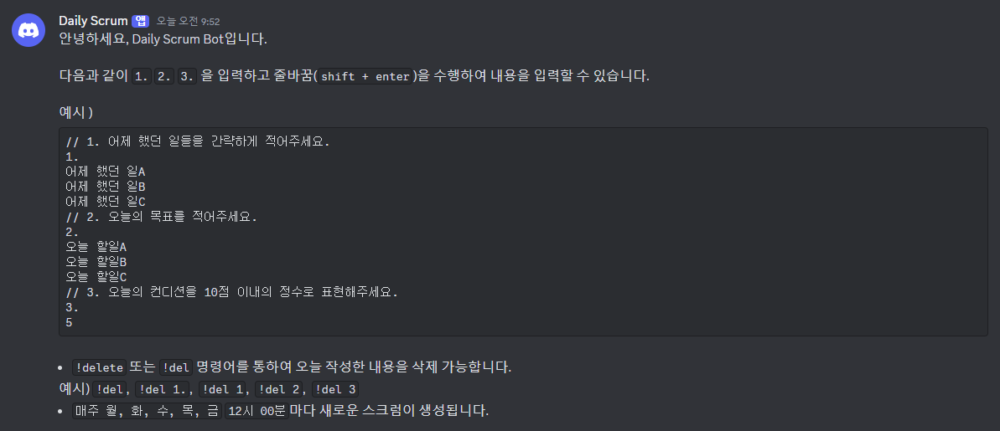
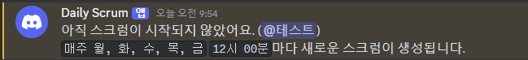
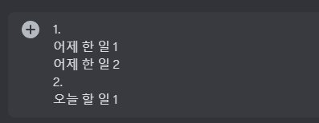
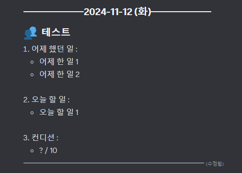
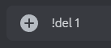
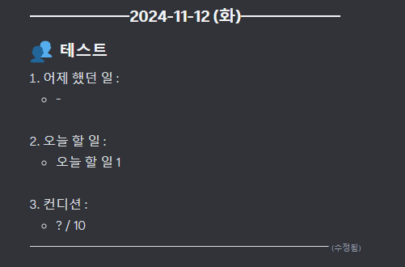

### 사용 방법

1. 먼저 `git clone`을 통하여 프로젝트를 다운로드하고, 프로젝트의 터미널에서 `npm install`을 입력하여 필요한 모듈을 설치합니다.

1. 디스코드 앱을 열고 환경설정에서 `개발자 모드`를 활성화 합니다. 개발자 모드를 활성화 하면 채널ID를 복사할 수 있게 됩니다.

1. Bot이 필요한 서버의 채널의 ID를 복사합니다.

1. 프로젝트의 루트 디렉토리에 `.env` 파일을 생성합니다.

1. `.env` 파일에 다음을 작성합니다.

```
CHANNEL_ID = 복사한채널ID
```

5. <a href='https://discord.com/developers/applications' target="_blank">`discord developer portal`</a>에서 `New Application` 을 생성합니다.

6. `Bot` 탭에서 TOKEN을 복사합니다.

7. `.env` 파일에 다음을 추가합니다.

```
CHANNEL_ID = 복사한채널ID
TOKEN = 발급받은토큰 붙여넣기
```

8. `discord developer portal`에서 `OAuth2`탭에서 `OAuth2 URL Generator`의 `bot` 항목을 체크하고, `Bot Permissions`의 `Administrator` 항목을 체크합니다.

9. 하단의 Generated URL을 복사하여, 브라우저나 디스코드의 채널에 붙여넣기하여 Bot을 사용할 수 있습니다.

10. 코드에서

```js
let cronExp = "0 0 12 * * 1,2,3,4,5 *";
```

부분의 cron표현식을 수정하여 반복 요일, 반복 시간을 수정할 수 있습니다.

### 동작 예시

- 봇 입장 시 :

  

- 스크럼 시작 전 입력 시 :

  

- 유저 입력 :

  

- 봇 메시지 출력 :

  

- 유저 삭제 입력 :



- 봇 메시지 수정 :


